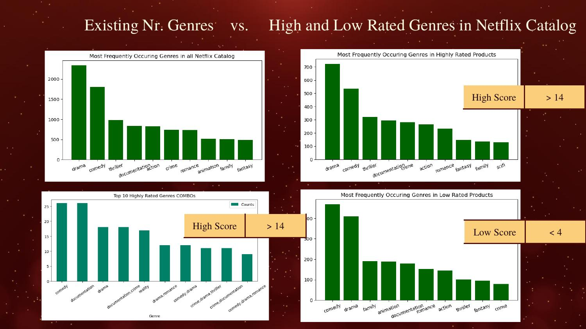
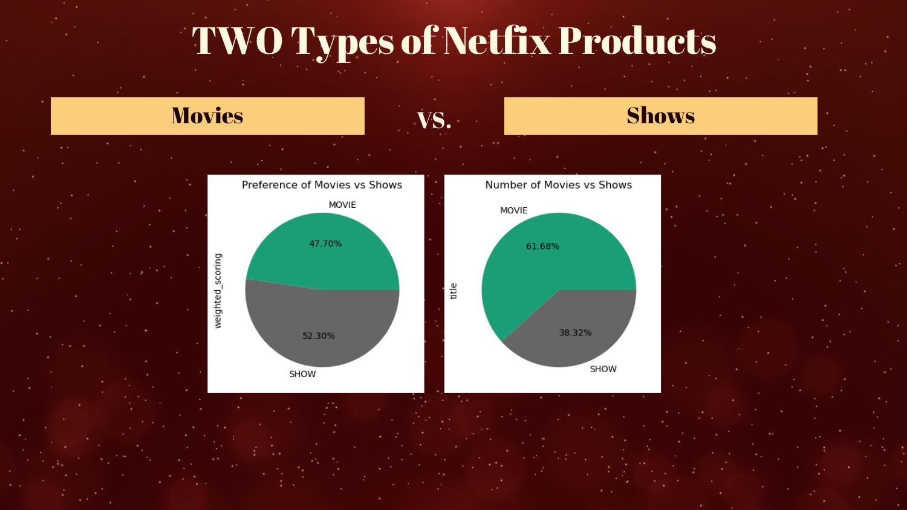
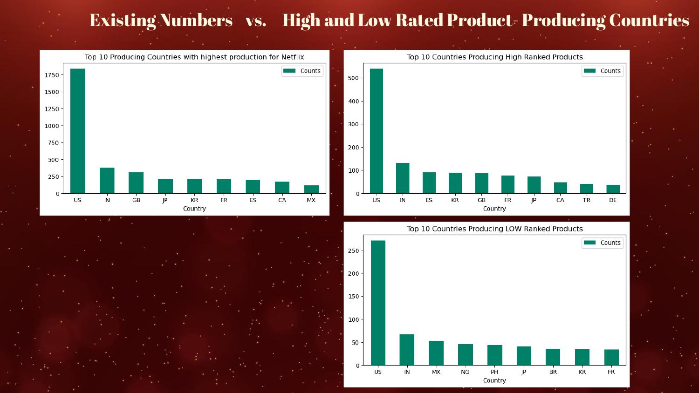
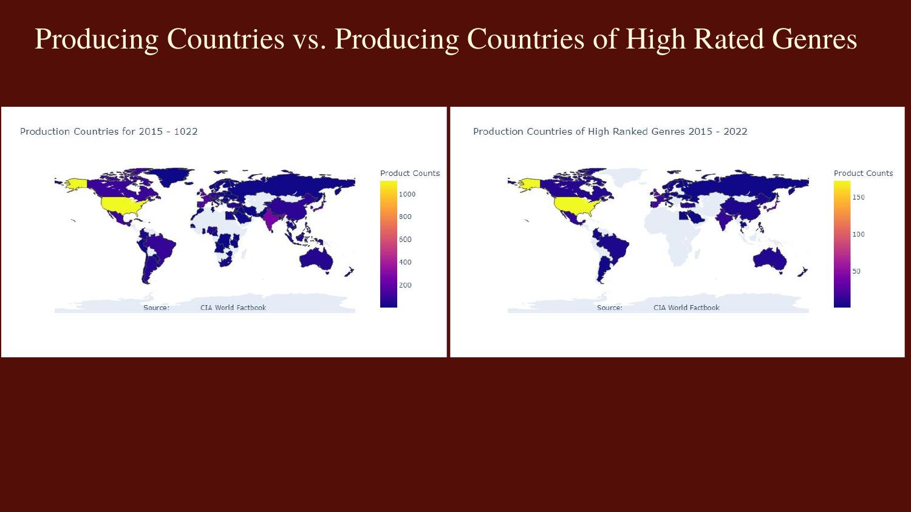
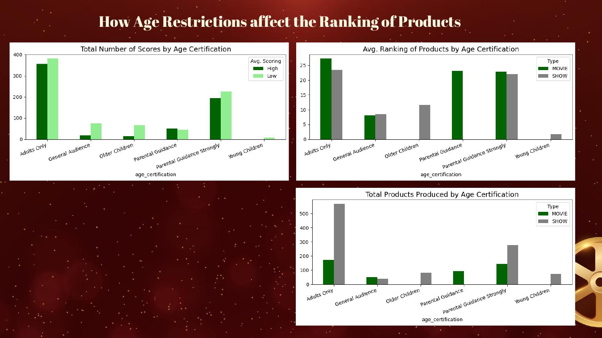
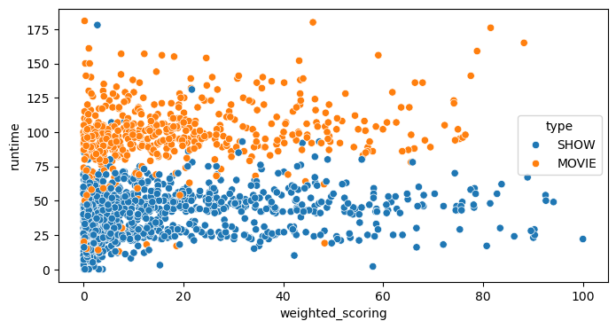

# TV Shows & Movies: A Netflix Success Factors Study

An exploratory data analysis project examining what drives high audience ratings across Netflix's content catalog — genre, format (movies vs. shows), producing country, age certification, runtime, and season count — translating the findings into concrete content-strategy recommendations.  

This work was produced in 2024 as part of a project for the Data Science Bootcamp, Big Blue Data Academy.

## Business Case

Netflix's catalog spans thousands of titles across genres, countries, and formats. This analysis investigates questions a content strategy team would actually ask:

1. Which genres earn the highest audience ratings?
2. Should Netflix invest more in movies or shows?
3. Which countries produce the highest-rated content?
4. How does age certification relate to how content is rated?
5. Does runtime affect how a title is rated?
6. Does a show's number of seasons affect audience preference?

## Methodology & Data Cleaning

- **Time window:** 2015–2022
- **Outlier removal:** identified and removed one specific extreme outlier — *Stranger Things* — which had an order-of-magnitude more IMDB votes (`imdb_votes`) than any other title in the dataset, isolated programmatically as the row at `df['imdb_votes'].max()`
- **Feature engineering:** constructed a normalized `weighted_scoring` metric from raw IMDB scores, then binned titles into **High / Medium / Low** scoring tiers to support the comparative analysis throughout — this is the basis for the "High Score" and "Low Score" thresholds referenced throughout the findings below
- **Data source:** [Netflix TV Shows and Movies dataset (Kaggle)](https://www.kaggle.com/datasets/victorsoeiro/netflix-tv-shows-and-movies)

## Key Findings

### Genres: The "Super Star" Genres

**Drama, Comedy, Thriller, Crime, and Romance** are consistently the highest-rated genres — and this holds true even when looking at genre *combinations*, not just single tags. Documentaries also rank highly, appearing across many genre combos, pointing to a broader audience preference for real stories. **Animation, Family, and Fantasy** rank consistently lowest across the board.

> **Recommendation:** prioritize investment in Drama/Comedy/Thriller/Crime/Romance — especially when grounded in real stories — while being more selective about Animation, Family, and Fantasy investment.

### Movies vs. Shows: An Investment Imbalance

Audience preference is nearly a coin flip — Shows edge out Movies only slightly (52.3% vs. 47.7% by weighted score). Yet Netflix's actual catalog skews the opposite way: **Movies make up 61.7% of titles produced**, against just 38.3% Shows.

> **Recommendation:** since audience preference doesn't justify the current production imbalance, increasing Show production is a reasonable strategic lever.

### Producing Countries: US Dominance, with a Clear Second Tier

The **US dominates** both in total production volume and in high-rated production specifically. A clear second tier — **India, Spain, South Korea, and Great Britain** — follows at meaningfully lower volume, but with high audience preference rates for what they do produce. **Nigeria, the Philippines, and Brazil** rank lowest among high-volume producers, and more than half the world contributes to Netflix's catalog in some form, though several countries (including Chile, Bulgaria, Indonesia, and parts of Africa) don't appear among the high-rated producers at all.

> **Recommendation:** Netflix's production strategy is well-positioned overall, with room to deepen investment in the India/Spain/Korea/UK tier specifically.

### Age Certification: An Untapped Middle

Netflix's two largest content categories by volume — **Adults Only** (~740 titles) and **Parental Guidance Strongly** (~420 titles) — are also its two highest-rated categories, suggesting the current investment allocation is broadly well-aligned with what audiences actually rate highly. The more interesting signal is **Parental Guidance movies**: a much smaller category (~90 titles) that still rates as highly as the top two. General Audience, Older Children, and Young Children are all comparatively small categories (70–90 titles each) that also rate lower on average, with Young Children rating lowest of all. A few category/type combinations (e.g., movies in the Older Children category) don't have enough titles to produce a reliable average at all.

> **Recommendation:** current investment in Adults Only and Parental Guidance Strongly content is already well-matched to what rates highly, so no correction needed there. The clearer opportunity is **Parental Guidance movies** — a small-volume category rating on par with the top performers, worth scaling up.

### Runtime: No Real Relationship to Rating

Movies run measurably longer than shows on average, as expected — but plotting runtime against weighted score shows no discernible trend in either direction. High-rated and low-rated titles exist across the full range of runtimes.

> **Recommendation:** runtime isn't a lever worth optimizing for content quality — a title's length should be driven by the story, not a perceived "ideal" duration for ratings.

### Seasons: More Isn't Necessary

- **63% of all shows have exactly one season**
- A commonly-cited "7 seasons = highest ratings" data point turned out to be **statistically unreliable** — only 3 shows exist in that category, too small a sample to draw a real conclusion from
- Shows with **3–6 seasons show stable, comparable average ratings** to one another

> **Recommendation:** Netflix could treat 3–6 seasons as a reasonable "budget-conscious" target — extending a show that far doesn't measurably hurt audience satisfaction, while going further doesn't reliably help either (the data to support that claim doesn't really exist).

## In a Nutshell: Strategic Recommendations

1. Content creators should prioritize **Drama, Comedy, Thriller, Crime, and Romance**, particularly when based on real stories, while being more cautious with Animation, Family, and Fantasy investment
2. **Increase Show production** — audience preference doesn't justify the current Movie-heavy catalog split
3. The **US leads production and quality**; India, Spain, South Korea, and the UK form a strong, currently under-invested second tier
4. Netflix's largest content categories (Adults Only, Parental Guidance Strongly) are already its best-rated, so current allocation looks sound; **Parental Guidance movies** stand out as a small but equally well-rated category worth scaling up
5. **Runtime is not a meaningful lever** for improving ratings
6. **3–6 season shows** offer a sound, budget-conscious target for renewal decisions

## Data & Tools

- **Language:** Python
- **Data manipulation:** pandas
- **Visualization:** matplotlib, seaborn, choropleth/geographic plotting (world map visualizations, sourced against CIA World Factbook country data)
- **Techniques:** outlier detection and removal, feature engineering (normalized weighted scoring), quantile-based binning, groupby/pivot aggregation, correlation analysis, scatter and bar visualizations across multiple dimensions (genre, country, age certification, runtime, season count)

## Files in This Repository

| File | Description |
|---|---|
| `EDA_Project_NEW.ipynb` | Full exploratory analysis: data cleaning, outlier removal, feature engineering, and all analyses (genre, format, country, age certification, runtime, seasons, director/actor influence) |
| `Presentation.pdf` | Stakeholder-facing summary of findings and business recommendations |

## Notes on Scope

This is an exploratory/descriptive analysis (aggregation, visualization, and business interpretation) rather than a predictive modeling project — no statistical hypothesis testing or machine learning models were applied. It's included here to demonstrate business-oriented data storytelling and the ability to translate raw data into actionable recommendations, alongside the more model-heavy projects elsewhere in this portfolio.
